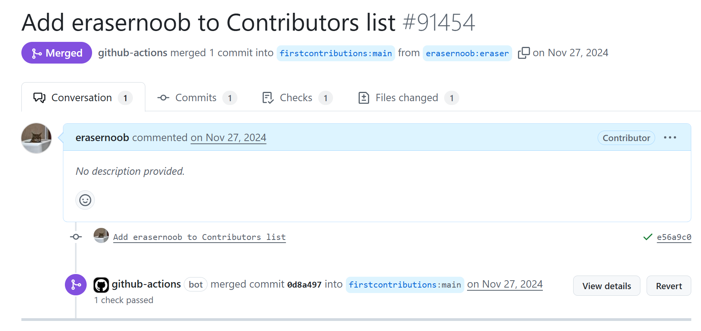

# first-contribution
Upload the first-contribution's gif and result ie. upload your homework
## 项目用途
:该项目仓库用于存放大数据智能团队成员完成第一个 PR 后的小练习的成功结果（截图以及表情包）
## 上传步骤
和 [First-contribution](https://github.com/firstcontributions/first-contributions) 流程一致：
- Fork 项目
- Clone Fork 之后的项目到本地
- 在本地相应的目录下添加作业结果
- Add Commit Push
- 向该仓库提交 PR
- 等待 PR 审核通过
- 练习完成
## 项目结构
根目录将会是以下结构：
```bash
├─2023
│  └─XingGuofu
├─2024
├─2025
├─2026
└─2027
```
- 一级目录为你的年级
- 二级目录为你的名字
- 你应该在你的年级文件夹下，新建一个你的名字的文件夹，并在其中放入你的 PR 成功截图，以及对应的庆祝 gif

例如：


