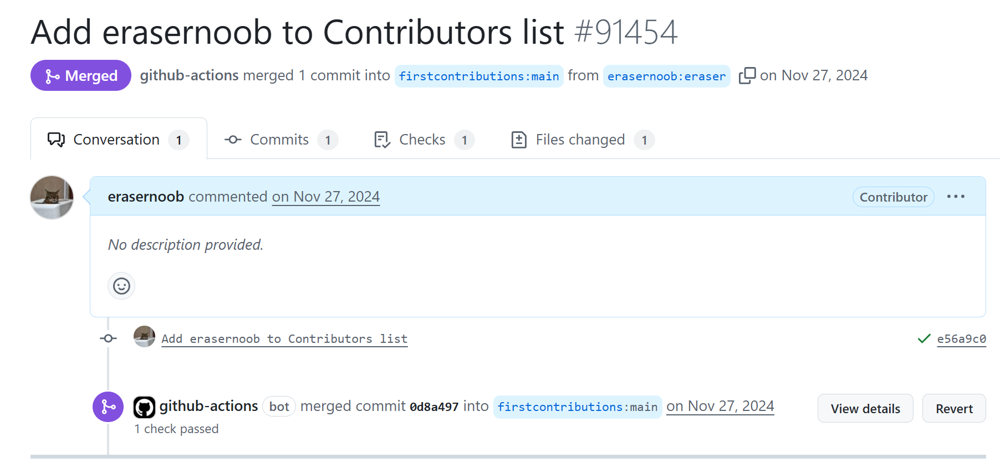

# first-contribution
## 项目用途
该项目仓库用于存放大数据智能团队成员完成第一个 PR 后小练习的成功结果（截图以及表情包）
## 上传步骤
和 [First-contribution](https://github.com/firstcontributions/first-contributions) 流程一致：
- Fork 项目
- Clone Fork 之后的项目到本地
- 在本地相应的目录下添加作业结果
- Add Commit And Push
- 向该仓库提交 PR
- 等待 PR 审核通过
- 练习完成
## 项目结构
根目录将会是以下结构：
```bash
├─2023
│  └─XingGuofu
├─2024
├─2025
├─2026
└─2027
```
- 一级目录为你的年级
- 二级目录为你的名字
- 具体格式参考：[此处](https://github.com/bigdata-io/first-contribution/tree/main/2023/XingGuofu)

例如：


